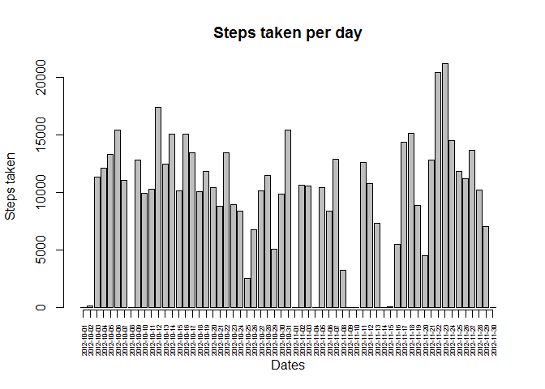
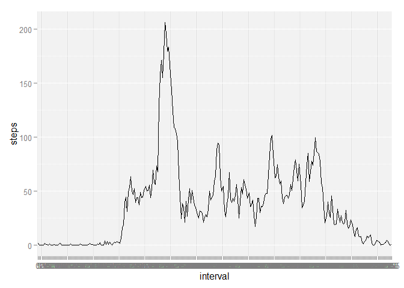
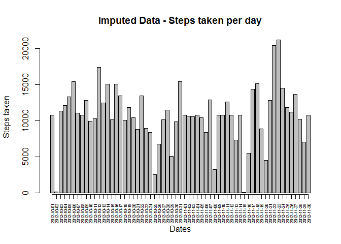
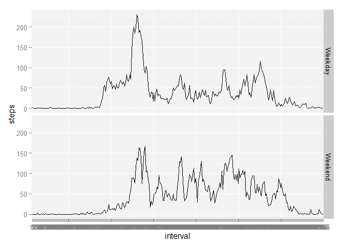

# Reproducible Research: Peer Assessment 1


## Loading and preprocessing the data


```r
activity = read.csv("activity.csv", na.strings = "NA")
activity$date = as.Date(activity$date)
```


## What is mean total number of steps taken per day?
##  1. Calculate the total number of steps taken each day


```r
library(dplyr)
```

```
## 
## Attaching package: 'dplyr'
## 
## The following objects are masked from 'package:stats':
## 
##     filter, lag
## 
## The following objects are masked from 'package:base':
## 
##     intersect, setdiff, setequal, union
```

```r
by_date = activity %>%
    group_by(date) %>%
    summarise(steps = sum(steps, na.rm = TRUE))

by_date
```

```
## Source: local data frame [61 x 2]
## 
##          date steps
##        (date) (int)
## 1  2012-10-01     0
## 2  2012-10-02   126
## 3  2012-10-03 11352
## 4  2012-10-04 12116
## 5  2012-10-05 13294
## 6  2012-10-06 15420
## 7  2012-10-07 11015
## 8  2012-10-08     0
## 9  2012-10-09 12811
## 10 2012-10-10  9900
## ..        ...   ...
```

##  2. Plot showing steps taken per day


```r
bp = barplot(by_date$steps, xlab = "Dates", ylab = "Steps taken", main = "Steps taken per day")
axis(at = bp, side = 1, las = 2, labels = by_date$date, cex.axis = 0.53)
```

 

##  3. Calculate and report the mean and median of the total number of steps taken per day


```r
mean(by_date$steps)
```

```
## [1] 9354.23
```

```r
median(by_date$steps)
```

```
## [1] 10395
```

## What is the average daily activity pattern?

##  1. Make a time series plot (i.e. type = "l") of the 5-minute interval (x-axis) and the average number of steps taken, averaged across all days (y-axis)


```r
library(ggplot2)
activity$interval = as.factor(activity$interval)
ggplot(activity, aes(interval, steps, group = 1)) + 
    stat_summary(aes(y = steps, group = 1), fun.y = mean, geom = "line", group = 1)
```

```
## Warning: Removed 2304 rows containing missing values (stat_summary).
```

 

##  2. Which 5-minute interval, on average across all the days in the dataset, contains the maximum number of steps?


```r
meansteps = activity %>%
    group_by(interval) %>%
    summarise(means = mean(steps, na.rm = TRUE))

meansteps[which.max(meansteps$means),]
```

```
## Source: local data frame [1 x 2]
## 
##   interval    means
##     (fctr)    (dbl)
## 1      835 206.1698
```

## Imputing missing values

##  1. Calculate and report the total number of missing values in the dataset 


```r
sum(is.na(activity$steps))
```

```
## [1] 2304
```

##  2. Filling in all of the missing values in the dataset. 
##  3. Create a new dataset that is equal to the original dataset but with the missing data filled in.

## Below, I create a copy of the original dataset called "dt2" and fill in the missing values of steps with the mean value of steps of that interval.


```r
dt2 = data.frame()
for (i in 1:dim(activity[1])){
    if (is.na(activity$steps[i])){
        dt2 = rbind(dt2, activity[i,])
        temp = match(activity$interval[i], meansteps$interval)
        dt2$steps[i] <- meansteps$means[temp]
    } else {
        dt2 = rbind(dt2, activity[i,])
    }
}
```

```
## Warning in 1:dim(activity[1]): numerical expression has 2 elements: only
## the first used
```

##  4. Make a histogram of the total number of steps taken each day and Calculate and report the mean and median total number of steps taken per day. Do these values differ from the estimates from the first part of the assignment? What is the impact of imputing missing data on the estimates of the total daily number of steps?


```r
by_date2 = dt2 %>%
    group_by(date) %>%
    summarise(steps = sum(steps, na.rm = TRUE))

by_date2
```

```
## Source: local data frame [61 x 2]
## 
##          date    steps
##        (date)    (dbl)
## 1  2012-10-01 10766.19
## 2  2012-10-02   126.00
## 3  2012-10-03 11352.00
## 4  2012-10-04 12116.00
## 5  2012-10-05 13294.00
## 6  2012-10-06 15420.00
## 7  2012-10-07 11015.00
## 8  2012-10-08 10766.19
## 9  2012-10-09 12811.00
## 10 2012-10-10  9900.00
## ..        ...      ...
```

```r
bp2 = barplot(by_date2$steps, xlab = "Dates", ylab = "Steps taken", main = "Imputed Data - Steps taken per day")
axis(at = bp, side = 1, las = 2, labels = by_date2$date, cex.axis = 0.53)
```

 

```r
mean(by_date2$steps)
```

```
## [1] 10766.19
```

```r
median(by_date2$steps)
```

```
## [1] 10766.19
```

##  The mean value in the second dataset has a higher mean (10766.19) compared to the first dataset (9354.23). In fact, even the median of the second data set is (10766.19) which is higher than the first set's median (10395). 

## Are there differences in activity patterns between weekdays and weekends?

##  1. Create a new factor variable in the dataset with two levels - "weekday" and "weekend" indicating whether a given date is a weekday or weekend day


```r
for (j in 1:dim(dt2[1])){
    if (weekdays(dt2$date[j]) == "Saturday"
        | weekdays(dt2$date[j]) == "Sunday") {
        dt2$wkd[j] = "Weekend"
    } else{
        dt2$wkd[j] = "Weekday"
    }
}
```

```
## Warning in 1:dim(dt2[1]): numerical expression has 2 elements: only the
## first used
```

```r
dt2$wkd = as.factor(dt2$wkd)
```

##  2. Make a panel plot containing a time series plot (i.e. type = "l") of the 5-minute interval (x-axis) and the average number of steps taken, averaged across all weekday days or weekend days (y-axis).


```r
ggplot(dt2, aes(interval, steps, group = 1)) + 
    stat_summary(aes(y = steps, group = 1), fun.y = mean, geom = "line", group = 1) +
    facet_grid(wkd ~ .)
```

 
